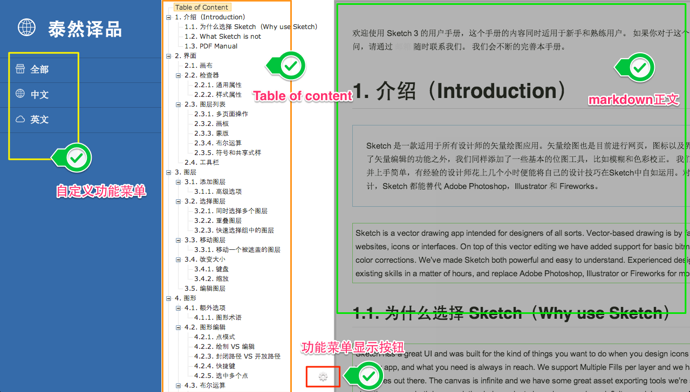

# [gulp](http://gulpjs.com)-trans v1.0.1 [](https://travis-ci.org/i5ting/gulp-trans)



 

trans description

- Compile Markdown to HTML with Table of Content
- With state : chinese , english  && all, convenient for translate review work


## Install

```sh
$ npm install --save-dev gulp-trans
```


## Usage

```js
var gulp = require('gulp');
var trans = require('gulp-trans');

gulp.task('default', function() {
	gulp.src('data/src/*.md')
		.pipe(trans())
		.pipe(gulp.dest('data/dist'));
		 
		var open = require("open");
		open("./data/dist/sample.html");
});

```

## resource

http://www.infoq.com/cn/articles/nodejs-about-buffer


## API

### trans(options)

See the marked [options](https://github.com/chjj/marked#options-1).


## License

MIT © [Alfred Sang](http://no320.com)
